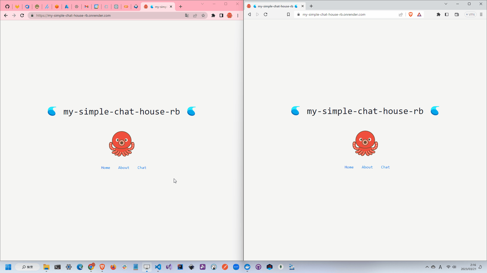

# img2excel-server.rb

🏗️🏗️🏗️ 画像をエクセルファイルに変換するツールのWEBサイト版です。  

  

## 実行方法

```shell
docker build -t img2excel-server-rb .
docker run --rm -d -p 8000:8000 --name img2excel-server-rb img2excel-server-rb
```

## 使用している技術

- Next.js
  - React
  - TypeScript
  - Bootstrap
- Ruby
  - Ruby on Rails
  - API mode
- Docker
- GitHub
  - Repository
  - GitHub Actions

## 自分用メモ

転職先の企業でRuby(Rails)を使うことになったので、学習用に、、、  

```shell
gem install rails
rails new . --database=sqlite3 --api
```

### コントローラの作成

```shell
rails g controller コントローラ名 アクション名
```

### モデルの作成

```shell
rails g model モデル名 カラム名:データ型
rails db:migrate
```
